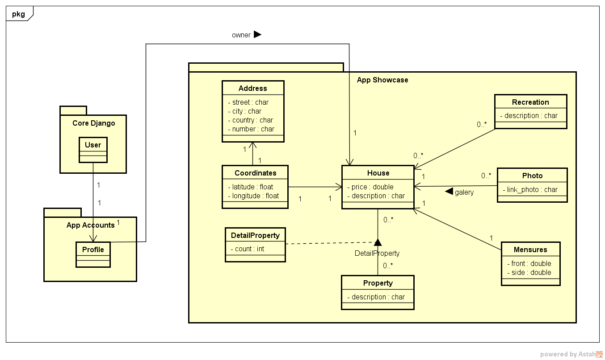

## Desafio proposto para uma aplicação-teste.

### Tecnologias

- Python
- Django
- Bibliotecas adicionais

### Requisitos

1. Desenvolva um sistema web de aluguel de imóveis simples. O sistema deve conter um front com a listagem de imóveis, incluindo a foto dos mesmos que, por sua vez, são cadastrados através de um CMS. Todos os inputs do CMS devem ser feitos utilizando forms. Não utilize o admin do Django para esses cadastrar os imóveis.

2. Customize o admin do Django a fim de listar os imóveis cadastrados com o endereço e um thumbnail (150 x 150px). É preferível que não seja possível inserir ou editar dados dentro do admin.

3. As telas de listagem precisam possuir um campo de busca por endereço e sugerir imóveis que se encontrem nas proximidades do mesmo.

### Documentação

> Descrição de algumas classes que podem não ter seu significado tão explícito.

- __Recreation__ : Indicará alguns recursos da casa que sejam um *plus* no quesito diversão , por exemplo: piscina, churrasqueira, TV à cabo...

- __Property__ : Essa classe servirá  para armazenar os atributos da casa, esse ( se possível ) será comum à todas as casas, sendo a classe ```DetailProperty``` uma quantificadora desse atributo na casa, por exemplo:

> Valores para ```Property```: Quarto, Suíte, Garagem, Andares..

> Valores para ```DetailProperty```: Quarto (2) , Suíte(3) , Garagem(3, nesse caso será a quantidade de vagas), Andares (2) ...

- __Mensures__ : Indicará as medidas da casa em questão.

- __Coordinates__ : Criado para poder inserir uma casa por meio do Google Maps, e assim criar um endereço associado à essa coordenada.

> Obs: As demais acredito que ficaram claras.

### Diagrama

